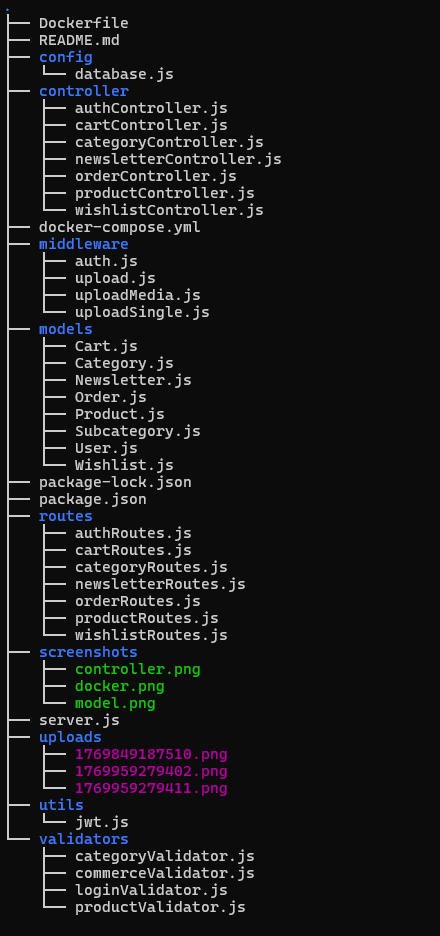
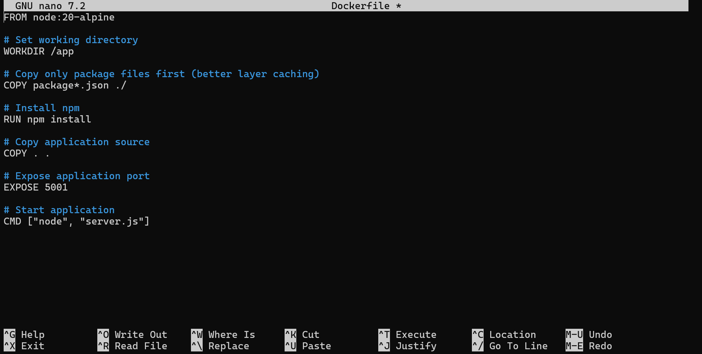
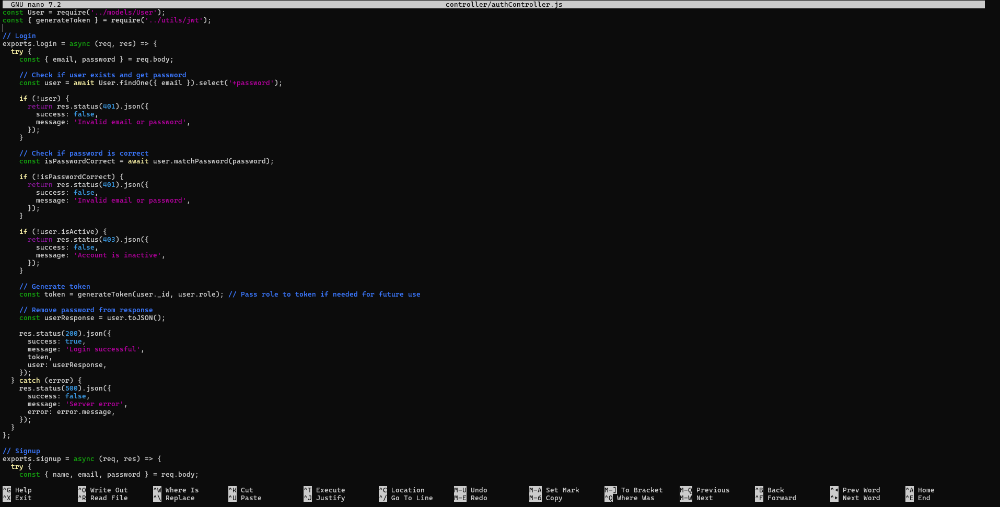
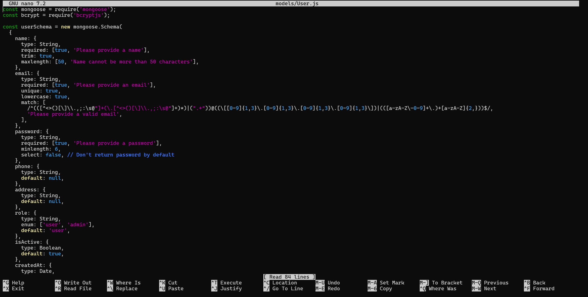

# 🛒 Ecommerce Backend API

A fully containerized Ecommerce Backend built using Node.js, Express, MongoDB, and Docker.
This project demonstrates backend architecture, REST API structure, and Docker-based deployment.

---

## 🚀 Tech Stack

- Node.js
- Express.js
- MongoDB
- Mongoose
- Docker & Docker Compose
- Nginx (Frontend static serving)
- JWT Authentication

---

## 📂 Project Structure

## ⚙️ Features

- User Authentication (JWT)
- Product Management
- Category & Subcategory
- Cart System
- Wishlist
- Order Management
- Newsletter
- File Upload Support
- Dockerized Backend + MongoDB

---

## 🔄 CI/CD Pipeline (GitHub Actions)

This project uses a fully automated CI/CD pipeline powered by GitHub Actions.

### 🚀 Deployment Flow

1. Developer pushes code to `main`
2. GitHub Actions workflow triggers
3. SSH connection to remote server
4. Server pulls latest code
5. Docker containers rebuild
6. Application restarts automatically

---

## 📸 Project Screenshots

### 🔹 Dockerized Backend Setup

### 🔹 Product Controller Logic

### 🔹 MongoDB Schema Design

---
