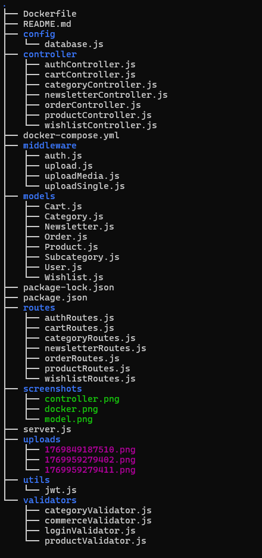
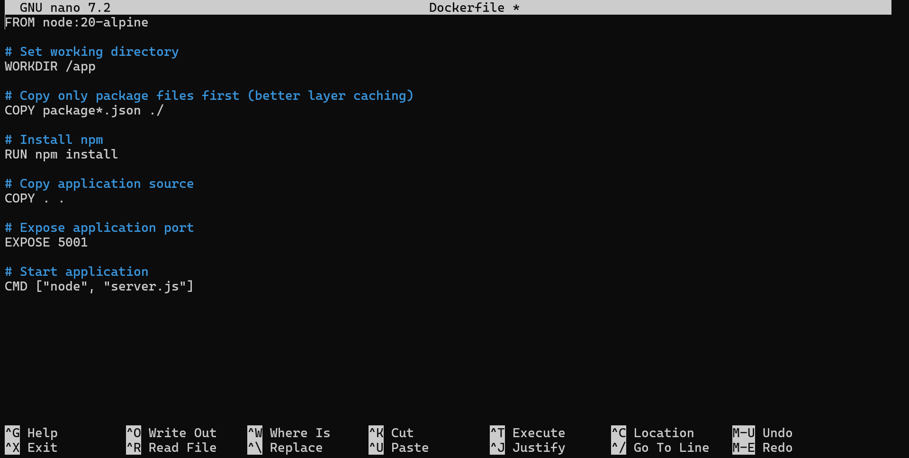
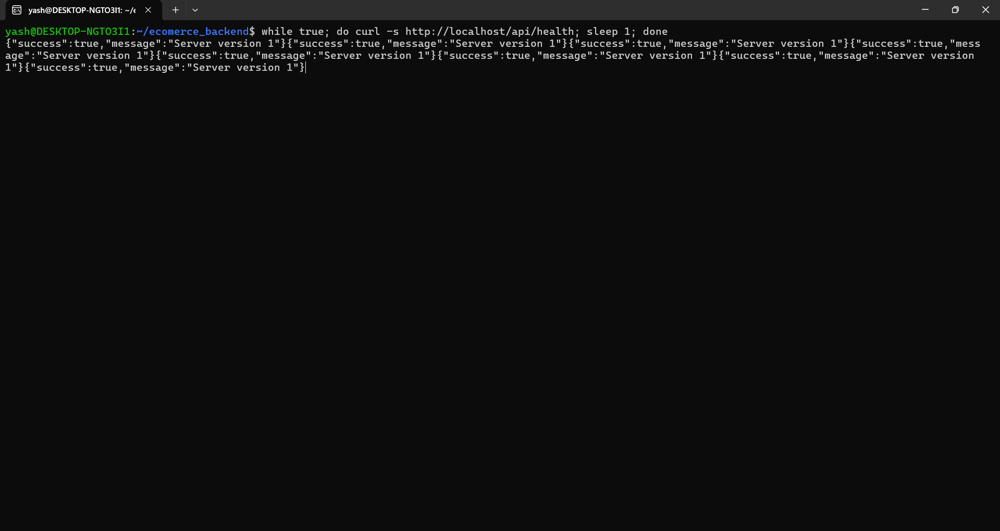
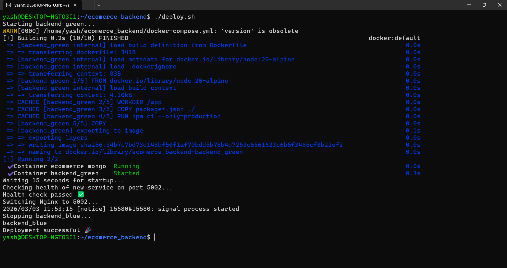
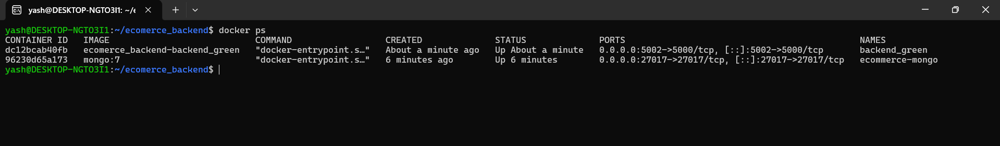
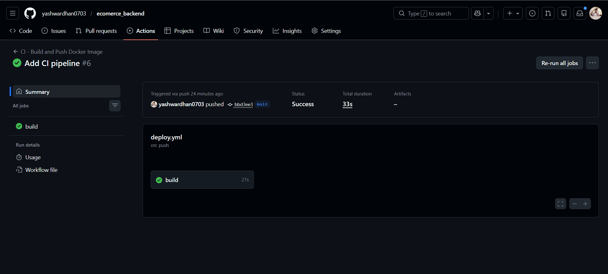

# 🛒 Ecommerce Backend – Dockerized Blue–Green Deployment with CI Pipeline

A fully containerized Ecommerce Backend built using Node.js, Express, MongoDB, and Docker.
This project demonstrates a Dockerized Node.js backend with a production-inspired Blue–Green zero-downtime deployment strategy and CI pipeline using GitHub Actions.

This project simulates production-grade DevOps deployment workflows locally, including CI automation, container image versioning, zero-downtime releases, and rollback safety mechanisms.

---

## 🚀 Tech Stack

- Node.js
- Express.js
- MongoDB
- Mongoose
- Docker & Docker Compose
- Nginx Reverse Proxy
- GitHub Actions
- Docker Hub

---

### 🏗 Architecture Overview
                NGINX (Reverse Proxy)
                       |
              -----------------------
              |                     |
        backend_blue           backend_green
                     \         /
                       MongoDB


---

## 📂 Project Structure



## ⚙️ Features

- User Authentication (JWT)
- Product Management
- Category & Subcategory
- Cart System
- Wishlist
- Order Management
- Newsletter
- File Upload Support
- Dockerized Backend + MongoDB

---

## 🔄 CI Pipeline (GitHub Actions)

This project includes an automated CI pipeline using GitHub Actions.

### 🚀 CI Flow

1. Developer pushes code to `main`
2. GitHub Actions workflow triggers automatically
3. Docker image is built
4. Image is tagged with:
   - `latest`
   - Commit SHA
5. Image is pushed to Docker Hub

This simulates a production-grade containerized release workflow.

---

## 🔄 Blue–Green Zero Downtime Deployment

This project implements a Blue–Green deployment strategy locally using Docker Compose and Nginx.

### 🏗 Deployment Strategy

- Two backend containers: `backend_blue` and `backend_green`
- Only one container serves traffic at a time
- During deployment:
  1. New container starts
  2. Health validation is performed
  3. Nginx upstream switches to new container
  4. Old container is stopped
- If health check fails → automatic rollback occurs

This ensures zero downtime during releases.

---

## ▶️ How to Run Locally

Start initial deployment:

```bash
docker compose up -d backend_blue mongo
```

Deploy a new version:

```bash
./deploy.sh
```

🔁 Includes automated rollback if the new deployment fails health validation.


---

✅ What this fixes:
- Properly closed `bash` blocks
- No broken markdown
- No nested triple backticks
- Clean formatting
- Professional look

---

## 📸 Project Screenshots

### 🔹 Dockerized Backend Setup


## 🧪 Zero Downtime Test



## 🚀 Deployment Script Output



## 🐳 Docker Containers



## 🤖 CI Pipeline Success



---
